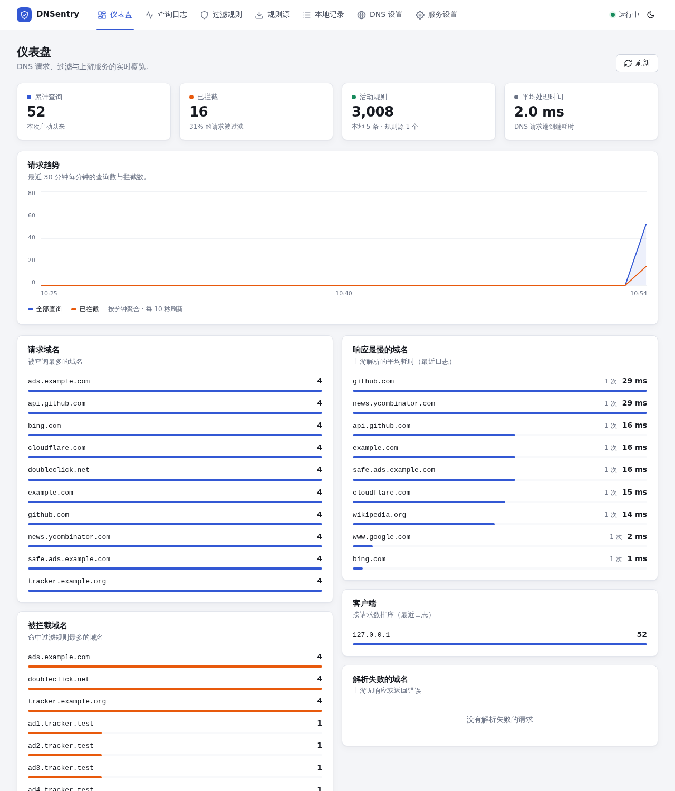
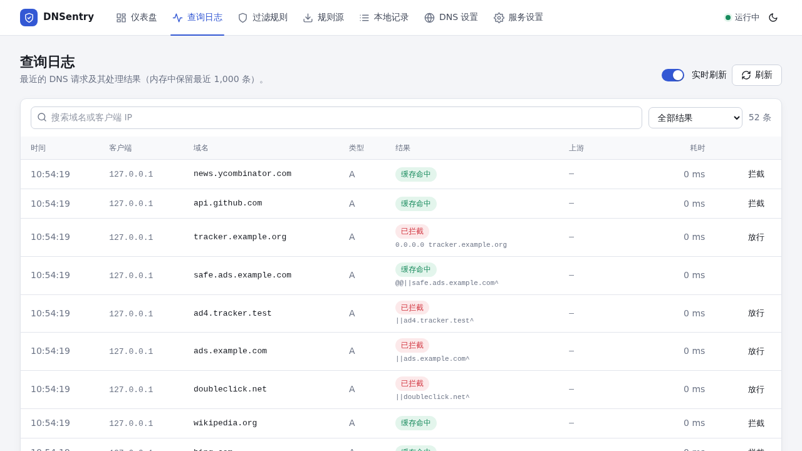
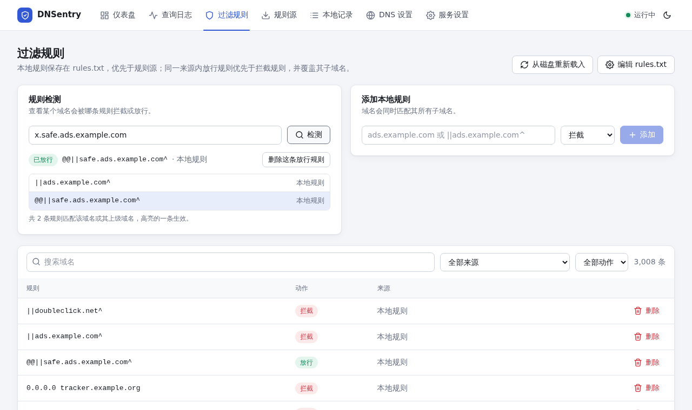
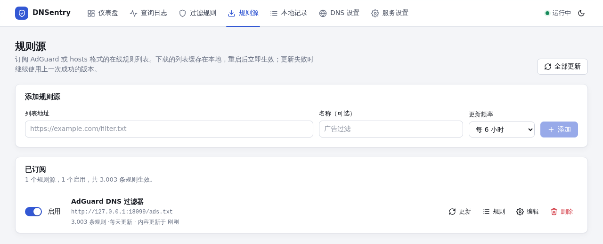
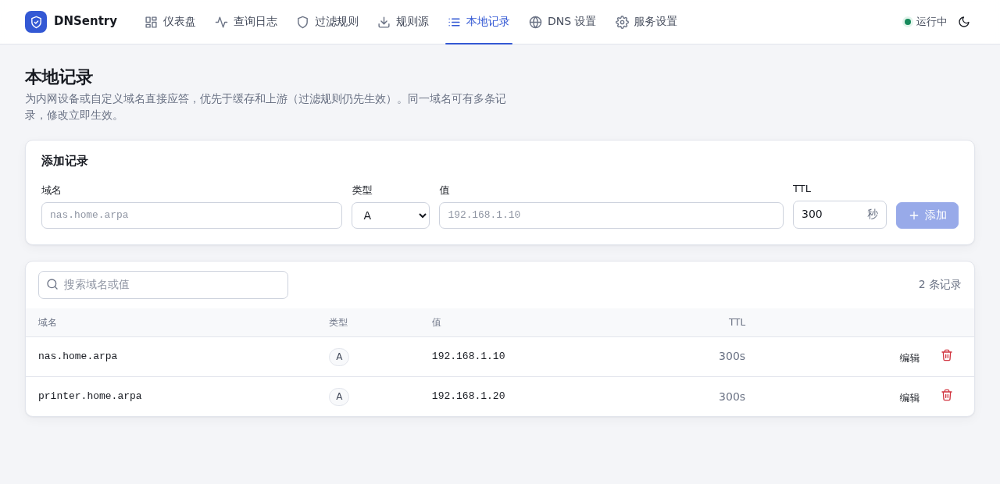
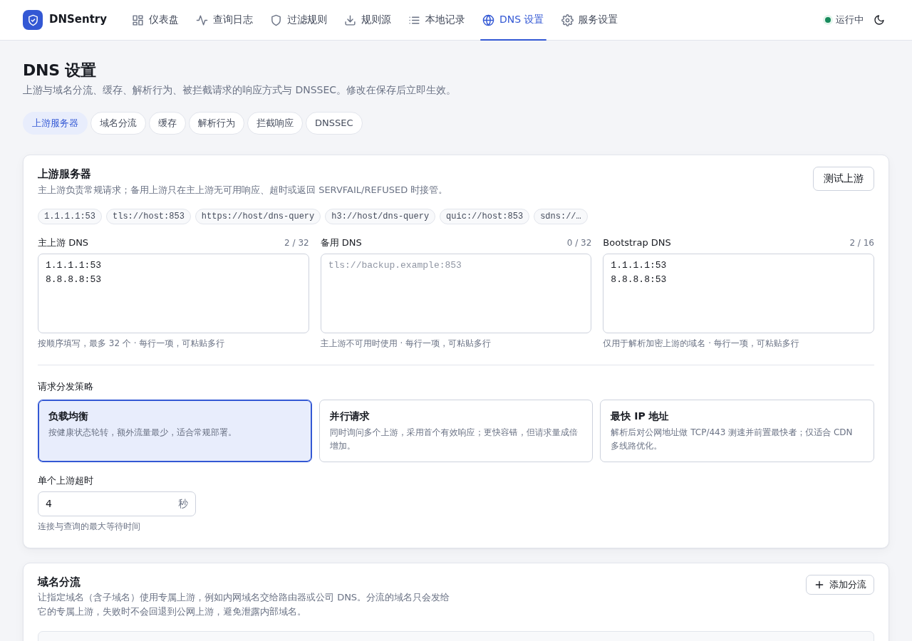
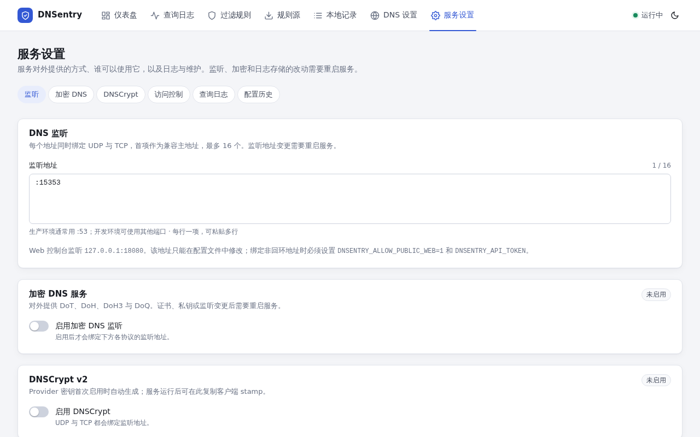
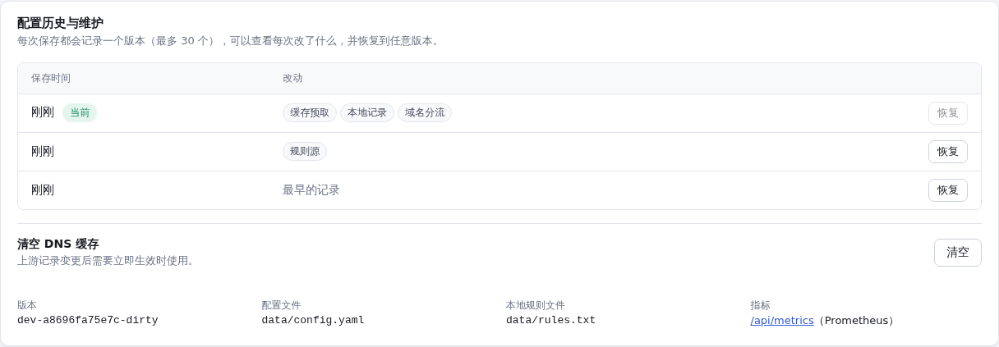
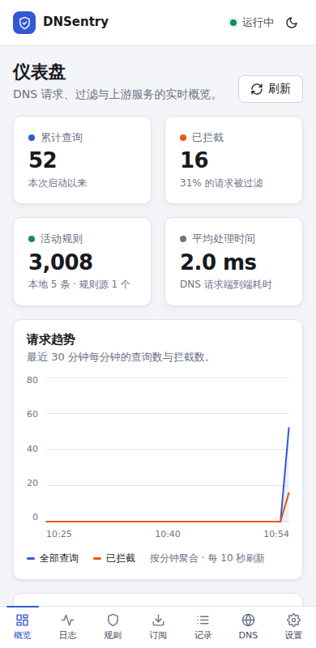

# 控制台使用指南

控制台是一个单页应用，顶部导航从左到右按“监控 → 过滤 → 配置”排列。深色 / 浅色主题用右上角的按钮切换，手机上导航会移到底部。

页面顶部会在出现问题时显示**提醒条**：规则源长期更新失败、所有默认上游都不可用、某条域名分流的上游全部失败，或者已保存的配置需要重启才能生效。每条提醒都带跳转按钮。

## 仪表盘

- **四个概览数字**：累计查询、已拦截（及占比）、生效中的规则数、平均处理时间。累计数字从本次启动开始计。
- **请求趋势**：最近 30 分钟每分钟的查询数和拦截数，鼠标悬停看具体数值。
- **排行卡片**：请求最多的域名、被拦截最多的域名、上游服务器（请求数与平均耗时）、响应最慢的域名、来源客户端、解析失败的域名。排行基于内存中的最近日志（条数由“服务设置 → 查询日志”决定）。
- **缓存**：命中率、条目数、占用空间、过期命中与预取次数，可一键清空缓存。
- **上游健康**：每个上游最近 30 分钟的延迟曲线，红色竖线表示那一分钟有失败。
- **安全与 DNSSEC**：被拒绝、限速、过载、Rebinding 拦截的次数，以及 DNSSEC 验证结果统计。

## 查询日志

- 显示最近的请求：时间、客户端、域名、类型、处理结果、使用的上游、耗时。
- **结果** 有：已转发、缓存命中、已拦截、已放行、本地记录、限速等；被规则命中的请求会在结果下方显示**所依据的规则**，鼠标悬停显示规则来源。
- 顶部可以按域名或客户端搜索、按结果筛选；点击客户端地址会只看这个客户端。**实时刷新**开关控制第一页是否自动跟随新请求（翻到其他页时不会刷新，避免打断你）。
- 每行右侧有快捷操作：被拦截的可以“放行”，正常转发的可以“拦截”，会为该域名（及其子域名）添加本地规则。

## 过滤规则

- **规则检测**：输入一个域名，显示它最终被哪条规则处理、规则来自哪里，并列出所有匹配的规则（高亮的一条生效）。可以直接一键放行 / 拦截，或删除已有的本地放行规则。
- **添加本地规则**：输入域名或 `||域名^` 写法，选择拦截或放行。
- **规则列表**：服务端分页，可按来源（本地或某个规则源）和动作筛选，搜索域名。来自规则源的规则是只读的；本地规则可以删除。
- **编辑 rules.txt**：直接编辑整个本地规则文件，保留注释和格式；Ctrl+S 保存，保存后立即生效，无法识别的行会列出行号。
- **从磁盘重新载入**：在外部修改了 `rules.txt` 之后使用。

## 规则源

- 订阅在线的规则列表，可设置名称和更新频率（每小时到每周，或自定义分钟数）。
- 每个规则源显示：规则数、更新频率、内容最近更新时间、最近检查时间；失败时显示错误原因，并说明是否仍在使用缓存的规则。
- 操作：**更新**（立即拉取）、**规则**（跳转到只看这个来源的规则列表）、**编辑**、**删除**（同时清除本地缓存）；开关可以停用规则源，停用后规则立即失效但缓存保留，重新启用时无需重新下载。**全部更新**一次刷新所有已启用的规则源。

## 本地记录

为内网设备或自定义域名直接应答（A、AAAA、CNAME、TXT），优先于缓存和上游。修改**立即保存并生效**，不需要点保存配置，也不会带上你在其他设置页里还没保存的修改。A / AAAA 记录还会自动生成对应的反向解析（PTR）。

## DNS 设置

页面顶部的标签可以跳到各个分区。**这一页和“服务设置”的改动都要点底部的“保存配置”才生效**，有未保存的改动时底部会出现保存栏。

- **上游服务器**：主上游、备用上游、Bootstrap DNS、请求分发策略、超时；“测试上游”逐个测试当前填写的地址（不写入缓存）。
- **域名分流**：让指定域名使用专属上游，见 [解析与加密 DNS](dns.md#域名分流)。

  
- **缓存**：开关、大小、TTL 上下限、预取、乐观缓存。
- **解析行为**：私网反向解析、禁用 AAAA。
- **拦截响应**：被规则命中后返回给客户端的内容（NXDOMAIN、空 IP、自定义 IP 或 REFUSED）与 TTL。
- **DNSSEC**：向上游请求 DNSSEC 数据、本地验证、信任锚。

## 服务设置

- **监听**：DNS 监听地址（每个地址同时绑定 UDP 和 TCP，最多 16 个），改动需要重启。
- **加密 DNS** 与 **DNSCrypt**：对外提供 DoT / DoH / DoH3 / DoQ / DNSCrypt，证书可以填路径或直接粘贴 PEM；运行后显示可复制的 DNSCrypt stamp。
- **访问控制**：允许 / 拒绝的客户端（IP 或 CIDR）、单客户端限速、最大并发、DNS Rebinding 防护。
- **查询日志**：内存日志条数；可选把日志按天写入 JSONL 文件。
- **配置历史**：

  

  每次保存都会记录一个版本（最多 30 个），列出**每次改了哪些设置**，可以恢复到任意版本。恢复本身也会被记录，所以可以再撤销。下方还有“清空 DNS 缓存”，以及版本号、配置文件路径和指标链接。

## 手机上使用

窄屏下导航移到底部，各页面改为单列布局，常用操作（查看日志、放行 / 拦截域名、规则检测）都可以在手机上完成。

## 保存与重启

- 大多数设置**保存后立即生效**。监听地址、控制台地址、规则文件路径、查询日志存储和加密 DNS 属于启动时设置，保存后会写入配置文件，但需要**重启服务**才生效——此时页面顶部会出现提醒。
- 没保存的改动不会被后台刷新覆盖；切换页面也不会丢。“放弃”按钮撤销所有未保存的改动。
